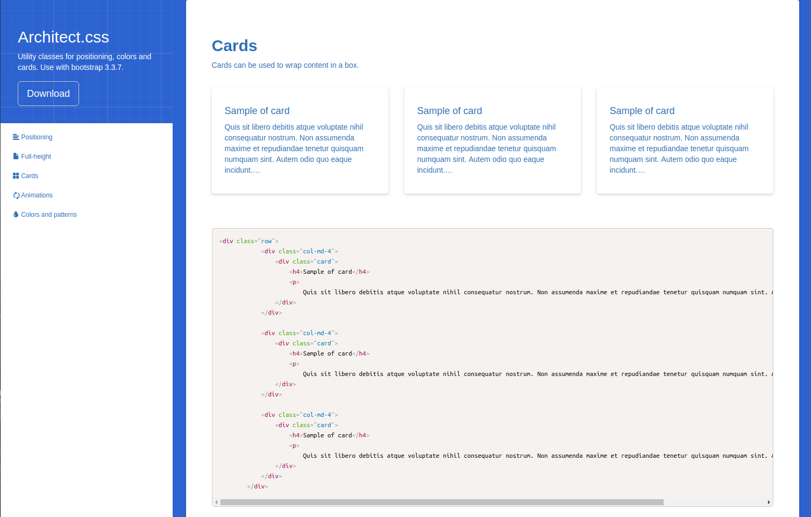

<div align="center">
  <br><br>
</div>

# Architect.css: Utility classes for positioning, colors and cards. Use with bootstrap 3.3.7.

## Features
- Positioning: Helper classes for padding/margin
- Full-height: Helper classes for full-height divs / backgrounds
- Cards: class to wrap content in
- Animations: Fade-in and spinner animations
- Colors: Colors and patterns for any div

## Prerequisites
To use architect.css, you will need the following:
- bootstrap 3.3.7

## Installation
Download the architect.css file in the dist folder.

### Add the stylesheet to your HTML file
```
<link rel="stylesheet" href="/stylesheets/architect.css">
```

## Usage
To view the documentations run:
```
node bin/www
```

## License
Licensed under The MIT License (MIT).
